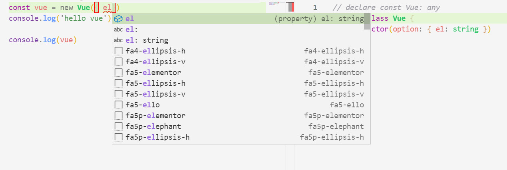

# module

## ts模块的认定

在ts中将一个不带有`import/export`的`ts`文件作为全局文件。这就意味着，如果带有`import/export`的文件可以认为是一个模块。


## 导入typings文件

`ts3.8`允许只导入`ts`文件中的声明变量，而不导入实际的变量。通过`import type`。

这就意味着，**不可以**使用导入的文件中有`javascript`实际存在的变量。


## 声明文件

### 声明语句

当我们在通过`<script src="xxx.js"></script>`直接引入时，我们可以在全局作用域下找到相应的变量，例如：

```js
// use_vue.js
// 已经在浏览器端通过script引入vue
const vue = new Vue({})
console.log(vue)
```

这在`js`文件中在自然不过了，但是`ts`并不认识这是什么类型的变量，也就是说，`ts`需要显示地知道变量的类型。

于是乎，我们需要预先声明变量的类型：

```ts
// use_vue.ts
declare var Vue: any

const vue = new Vue()
```

上面代码中`declare var Vue: class`就是来告诉`ts`编译器，存在一个`Vue` 的`class`。


### 声明文件

在上面的代码中，很明显`declare`语句需要从文件中抽离出来。

在`ts`中，采用`xxx.d.ts`作为声明文件，用于声明变量。

于是上面的文件可以划分为两个独立的文件：

```ts
// use_vue.ts
const vue = new Vue()
```

```ts
// Vue.d.ts
declare var Vue: any	// 也可以将var替换成let/const
```


### 声明指定类型

从上面的过程来看，我们直接将`Vue`声明为`any`，但事实上，这并不合理。`Vue`实际是一个类，于是我们可以为其声明指定的类型：

```ts
// Vue.d.ts
declare class Vue {
  constructor(option: { el: string })
}
```

由于我们将Vue声明为一个类，并且在其构造函数中显示指明了`option`，所有我们在`new Vue`时，也需要传入一个`option`，而且采用了这种声明，在`new Vue`时，`ts`会自动给我们提示：




## npm 包

通过`npm intstall package-name --save`下载包时，是否会携带对应的声明文件，需要根据包的管理者是如何创建该包的：

1. 声明文件与包文件绑定在一起。判断依据是`package.json`中的`types/typings`字段，或者对应的`xxx.d.ts`声明文件。
2. 声明文件与包文件分离。如果在使用`ts`时出现找不到声明文件的错误时，可以尝试使用`npm install @types/xxx --save-dev`来下载对应的声明文件。
3. 声明文件不存在。如果以上的方式都行不通时，说明该包的管理者并没有为该包撰写声明文件，这时候我们就需要自行撰写声明文件。


### 声明文件的撰写

声明文件可以通过一下两种方式创建：

1. 在`node_modules/@types`创建对应的声明文件。
2. 在项目的根目录中，创建`types`文件夹存放声明文件，然后通过`tsconfig.json`中的`paths`和`baseUrl`字段进行配置。

由于`node_modules`的不确定性，一般采用第二种方式来定义声明文件。


例如：

```bash
# 项目的目录结构
.
│  package.json
│  tsconfig.json
│
├─src
│      index.ts
│
└─types
    └─Vue
            index.d.ts
```


```json
// tsconfig.json
{
  "compilerOptions": {
    "target": "es5", 
    "module": "commonjs", 
    "outDir": "./dist",   
    "rootDir": "./src",   
    "strict": true,
    "baseUrl": "./",
    "paths": {
      "*": ["./types/*"]
    }, 
     "esModuleInterop": true,
    "forceConsistentCasingInFileNames": true
  }
}
```

其中，最主要的是`paths`、`baseUrl`字段，这两个字段配置了声明文件的位置。


## export

npm包的声明文件`.d.ts`与普通的`ts`文件没有多大的区别，只是包声明文件不能提供具体的定义。这类似与`c/c++`的头文件和定义文件一样。

### `decalre`与`export declare`的区别

使用`declare`直接创建的声明文件具有全局性，对于所有的`ts`文件都可见，所以在任何的`ts`文件中都可以直接地使用`declare`中声明的`types`。


使用`export declare`导出的声明文件只对对应模块有效。

例如：

```ts
// ./types/global/index.d.ts
declare class Foo {}

// ------------------------
// ./types/Bar/index.d.ts
declare class Bar {}
declare function getBar (): Bar

export { Bar, getBar }
```

```ts
// ./src/export/index.ts
const foo = new Foo()

//! error: Cannot find name 'Bar'.
const bar = new Bar()
```

由于`Bar`是通过`export`导出的声明文件，所以它并非是全局可见的，需要在使用`import { Bar } from 'Bar'`后才能正常使用。


`export`导出声明文件与`es6`导出模块类似，可以使用`export default`和`export declare ...`

### 声明module的另一种方式

通过`export declare`可以导出模块的声明，也可以采用`declare module 'moduleName'`导出声明文件。例如：

```ts
// ./types/Baz/index.d.ts
declare module 'Baz' {
  class Baz {
    constructor (option: any = {})
  }
  function getBar (): Baz {}
}
```

## `import = && export =`

`import = require('xxx')`对应的是`commonJS`中`const xxx = require('xxx')`

`export = xxx`对应的是`commonJS`中`exports.default = xxx`


## 直接拓展全局变量

有的第三方库已经对全局变量进行拓展，但是全局变量的类型却没有及时更新，再使用`ts`时就会出现错误。

例如：我们在js文件中对string进行拓展，但是这并没有反应到`ts`中，`ts`会认为`''.extend()`是错误的。

```js
// ./src/extend/index.js

String.prototype.extend = (suffix) => {
  return this + (suffix ? suffix : '')
  // return this + suffix
const hello = 'hello'
console.log(hello.extend(' world'))
console.log(hello.extend())
```


在全局的声明文件中，拓展全局变量

```ts
// ./types/global/index.d.ts
interface String {
  extend(suffix?: any): string
}
```


## `decalre module`：拓展模块

+ 声明文件
  1. 导入原先的声明文件
  2. 拓展原先的声明文件
  3. 以模块的方式导出

+ ts文件
  1. 导入原先的模块
  2. 导入拓展文件

### 示例1

```ts
// types/moment-plugin/index.d.ts

import * as moment from 'moment';

declare module 'moment' {
    export function foo(): moment.CalendarKey;
}
```

```ts
// src/index.ts

import * as moment from 'moment';
import 'moment-plugin';

moment.foo();
```


### 示例2：为vue添加$echart

```ts
// ./vue.d.ts
declare module '*.vue' {
  import Vue from 'vue'
  export default Vue
}
```

```ts
// ./shims-vue.d.ts
import Vue from 'vue'

// node_modules/vue/types/vue
declare module 'vue/types/vue' {
  interface Vue {
    $echarts: any
  }
}
```


## 自动生成声明文件

在`tsconfig.json`中配置，`declaration`字段生成对应的声明文件。配置`declarationDir`可以指定声明文件输出的位置

```json
{
    "compilerOptions": {
        "module": "commonjs",
        "outDir": "./dist",
        "declaration": true,
        "declarationDir": ""
    }
}
```


## 发布声明文件

1. 为`package.json`中的`types/typings`指定声明文件的路径
2. 在项目的根目录下，编写`index.d.ts`文件
3. 为每个文件配置一个同名但不同后缀的声明文件`.d.ts`。


## references

[Typescript入门教程](https://ts.xcatliu.com/basics/declaration-files.html)

